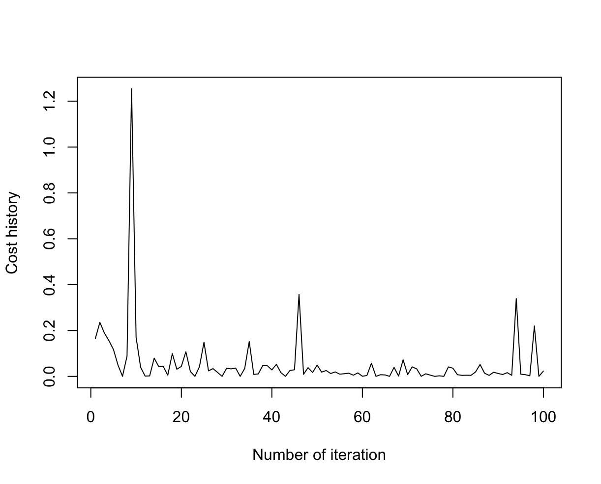
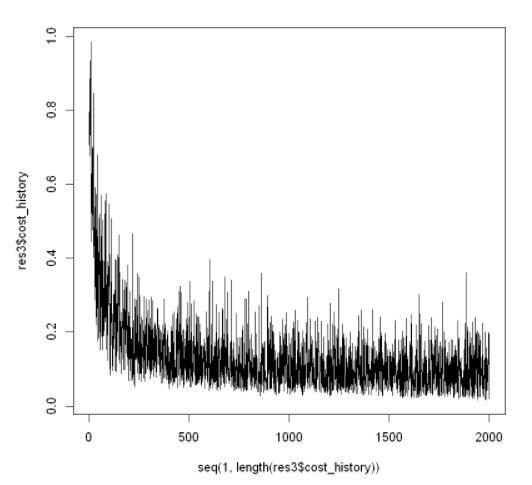

rlgd
====

The rlgd package is intended to provide the best statistical model to study the relationships between a set of explanatory variables Xi and a target variable Y. It uses the binary logistic regression algorithm with the stochastic gradient descent method to predict the probability of an event occurring (value of 1) or not (value of 0) based on the optimisation of the regression coefficients.

Installing the package
----------------------

    devtools::install_github(repo='Romain8816/M2_RPackage/rlgd',build_vignettes = TRUE)

Tutorial for package usage
--------------------------

### Loading the library

Once the package is installed, the library can be load using the standard commands from R.

    library(rlgd)

### Dataset Import

First, you need to import a dataset (with a set of categorical variables Xi and a categorical variable Y). In this example, we will use the breast_cancer dataset. This dataset is included in the rlgd package.

    rlgd <- rlgd::breast_cancer // data(breast_cancer)

The breast_cancer dataset includes information on patient cells and contains 9 explanatory variables and 1 binary target variable: class which takes the value malignant or begnin.

The dataset is therefore in the *breast_cancer* object, so we can start fitting our linear model.

**Note: If you are unsure about a function, use **help(name_function)** or **?name_function** , example: **?fit**.

------------------------------------------------------------------------

Data preparation
----------------

### Conversion of the target variable to 0/1 if it is not the case

### Separation of training and test samples

For the example tests to follow, we divide our dataset into two samples: training sample and test sample.

    set.seed(10)
    train_index <- createDataPartition(breast_cancer$classe, p = 0.7, list = F)
    
    train_set <- breast_cancer[train_index, ]
    test_set <- breast_cancer[-train_index, ]
    

### Overview of data with get_x_y function

### Example 1 with "batch" mode : 

In this first example we illustrate the *batch* mode of gradient descent. The first step is to apply the fit function to our learning sample :

    res1 <- fit(classe ~ ., train_set, mode = "batch", batch_size = 32, learning_rate = 0.01, max_iter = 1000, tol = 1e-4)
    
    #print 
    
The object *res1* contains the coefficient matrix of the model and the cost matrix which can be illustrated as follows:
    
    plot(seq(1, length(res1$cost_history)), res1$cost_history, type = "l")
    

Now we can apply the prediction function to the test sample :

    y_pred <- predict(res1, test_set[, res1$x_names], type = "class")
    
Then, it is possible to measure the quality of predictions by calculating the accuracy :
    
    accuracy <- mean(y_pred == test_set[, res1$y_name])
    print(accuracy)
    
    #print
   

### Example 2 with "online" mode : 

Here is another example, this time using the *online* mode of stochastic gradient descent.

    res2 <- rlgd.fit(classe ~ ., train_set, mode = "online", batch_size = 32, learning_rate = 0.01, max_iter = 100, tol = 1e-4) # nolint
    plot(seq(1, length(res2$cost_history)), res2$cost_history, type = "l")
    

    
    y_pred <- rlgd.predict(res2, test_set[, res2$x_names], type = "class")
    accuracy <- mean(y_pred == test_set[, res2$y_name])
    print(accuracy)

### Example 2 with "mini-batch" mode : 

This last example finally illustrates the *mini-batch* mode of gradient descent applied to logistic regression.

    res3 <- rlgd.fit(classe ~ ., train_set, mode = "mini-batch", batch_size = 32, learning_rate = 0.01, max_iter = 2000, tol = 1e-4) # nolint
    plot(seq(1, length(res3$cost_history)), res3$cost_history, type = "l")
    

    
    y_pred <- rlgd.predict(res3, test_set[, res3$x_names], type = "class")
    accuracy <- mean(y_pred == test_set[, res3$y_name])
    print(accuracy)

------------------------------------------------------------------------

### That’s it!

This is the end of the overview of the main functions of our package. Let's practise !

